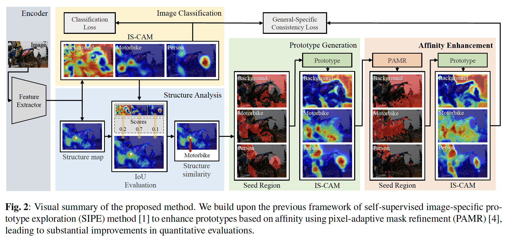

# AFFINITY ENHANCED IMAGE-SPECIFIC PROTOTYPES FOR WEAKLY SUPERVISED SEMANTIC SEGMENTATION (AE-SIPE)



The implementation of **AFFINITY ENHANCED IMAGE-SPECIFIC PROTOTYPES FOR
WEAKLY SUPERVISED SEMANTIC SEGMENTATION**, Jungsun Im, Subin An, Soochahn Lee.

## Abstract
Many weakly supervised semantic segmentation methods rely on the pixel-level features extracted from networks trained for image classification. These features can be used to create class activation maps for semantic scores, define pixel affinity as feature similarities, and construct per-class feature prototypes based on feature clustering. This paper proposes a method that enhances previous works by incorporating affinity-based refinement into the generation of image-specific per-class prototypes, resulting in significantly improved representative strength. These prototypes then lead to improved pseudo-labels, ultimately improving segmentations. Experimental results show significant improvements compared to baseline methods, and are on par with recent state-of-the-art methods.

## Environment

- Python >= 3.6.6
- Pytorch >= 1.6.0
- Torchvision

## Usage

#### Step 1. Prepare Dataset

- PASCAL VOC 2012: [Download](http://host.robots.ox.ac.uk/pascal/VOC/voc2012/).
- MS COCO 2014: [Image](https://cocodataset.org/#home) and [Label](https://drive.google.com/file/d/1Pm_OH8an5MzZh56QKTcdlXNI3RNmZB9d/view?usp=sharing).

#### Step 2. Train SIPE

```bash
# PASCAL VOC 2012
bash run_voc.sh
```

#### Step 3. Train Fully Supervised Segmentation Models

To train fully supervised segmentation models, we refer to [seamv1](https://github.com/YudeWang/semantic-segmentation-codebase/tree/main/experiment/seamv1-pseudovoc).


## Results

### Localization maps

| Dataset         | Model       | mIoU (Train) |
| --------------- | ----------- | ------------ | 
| PASCAL VOC 2012 | SIPE        | 58.88        |
| PASCAL VOC 2012 | AE SIPE     | 65.78        |

### Segmentation maps

| Dataset         | Model                    | mIoU (Val)   | mIoU (Test) | 
| --------------- | ------------------------ | ------------ | ----------- | 
| PASCAL VOC 2012 | SIPE with ResNet101      | 68.8         | 69.7        |
| PASCAL VOC 2012 | AE SIPE with ResNet101   | 71.0         | 71.1        |


## Acknowledgement
This code and README is highly borrowed from [SIPE](https://github.com/chenqi1126/SIPE). Thanks to Qi Chen.